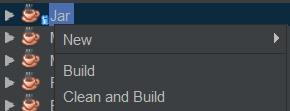
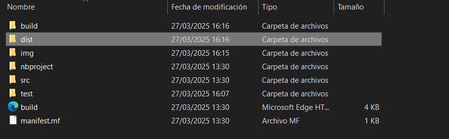
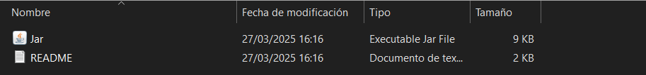
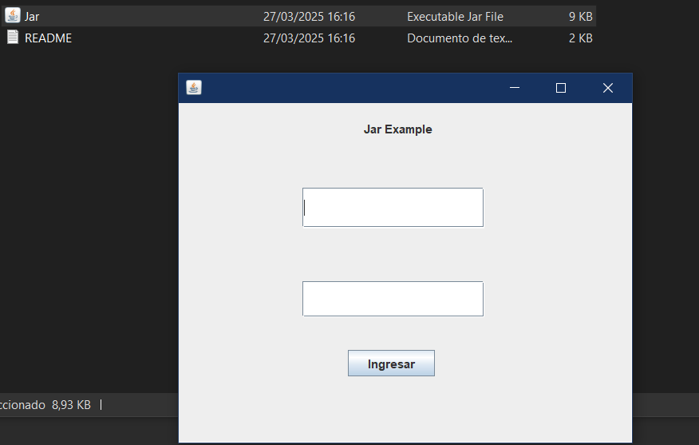

## Generacion Jar

### Netbeans

1. Acceder al panel de proyectos y hacer clic derecho sobre el proyecto del cual se desea generar el archivo .jar

    Posteriormente seleccionar la opcion Clean and Build

2. Una vez seleccionado Clean and Build dentro del proyecto se observara una carpeta llamada dist 

3. Dentro de la carpeta dist se ubica el archivo .jar generado

4. Una vez visualizado el .jar podran ejecutar su proyecto al hacer clic sobre el.

**Es fundamental que suban este archivo .jar a su repositorio, junto con el código fuente, los manuales y el diagrama de flujo correspondientes.**

### IntelliJ

https://youtu.be/eHAAMLRBIJ4?si=LdP7TMdRXl_84cfj