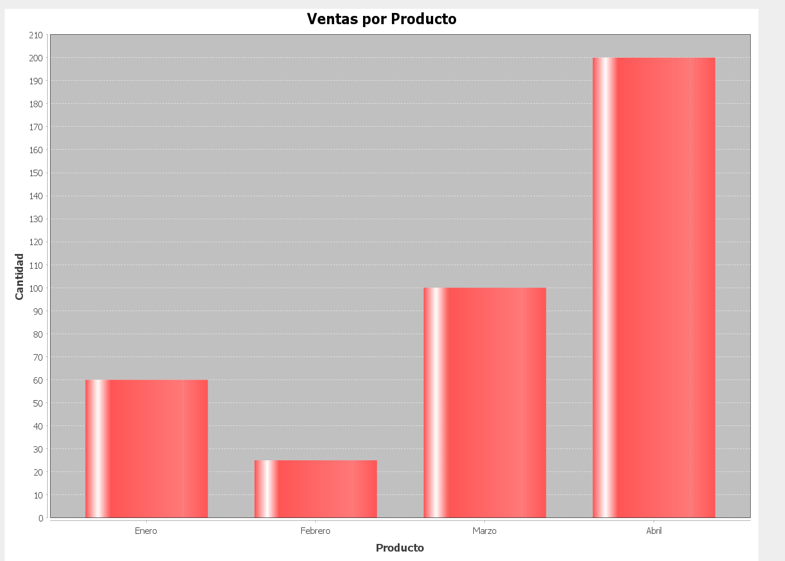

## jfreechart-1.5.3

Se necesita un contenedor en la interfaz gráfica (JFrame) donde se mostrará el gráfico. Este contenedor puede ser un JPanel, el cual es util para agregar el gráfico generado.

Para utilziar jfreechart se tiene que incluir el .jar  en la biblioteca del proyecto.

### Pasos a seguir

- En la sección de Bibliotecas o Libraries, realizar clic en el botón Agregar JAR/Carpeta

- Navegar en la ubicación donde se descargo el archivo jfreechart-1.5.3.jar y seleccionar este archivo.

### Enlace para descargar el .jar de jfreechart-1.5.3

https://drive.google.com/drive/folders/1AdzwWDmVNOnh_dxYgq3jloMu98VvdXLG?usp=sharing

### Resultado

